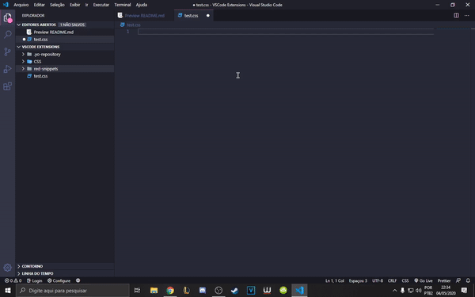

<h1 align="center"> RedSnippets </h1>

 The best extension to make your life easier, using VSCode snippets for CSS and HTML!  

## Snippets

- ### resets

Resets default styles, margin, padding and outline

- ### centralize

Stylize div to align content to center

- ### inithtml

Initializes a HTML file

## Github Link

### https://github.com/ReddyyZ/RedSnippets
